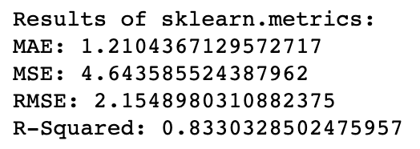

# Predicting business Risk

**A machine learning regression problem that predicts the risk of user persisting with the business given several parameters**

- Data:
    - **`assignment_train.csv`**: This file contains over 46000 records and 94 columns. There are multiple parameters of the customer, reference by the `agent_id`, with the business over period of time. There is the target column `business_risk` which assess the risk of the user persisting with the business. 
    - **`assignment_test.csv`**: This file contains over 26000 records, all similar to train file - `assignment_train.csv`, except that it does not contain the target column `business_risk`. All other parameters remains the same.
    - **`data_dictionary.csv`**: This is a file which has the mapping between the column names and the corresponding meaning associated with the column.

## Steps to run the project:

1. Setup a virtual environment for the project:
    ```bash
    python -m venv myenv
    ````
2. Activate the virtual environment:
    ```bash
    source myenv/bin/activate
    ````
3. Install the dependencies:
    ```bash
    pip install -r requirements.txt
    ```
4. Open the jupyter notebook:
    ```bash
    jupyter notebook ./customer_risk.ipynb
    ```
5. Run all the cells

----

## Explaining the approach

There are 93 columns in the train data set except for the target column, the data is huge. There are multiple different ways of getting started. One could work only on the chunk of the dataset and then generalize the results. I chose not to.

In my approach, I take all the columns and instead of directly applying the dimensionality reduction techniques, I do the exploratory data analysis. Since there is no preprocessing required for this data set, a lot of time is spared.

Upon doing the analysis, we quickly come across the problem of scale and outliers. 
1. The `data vary greatly in scale`, and 
2. There are some `outliers`, and there is a significant amount of them that totally skew the analysis.

Our solution could be to normalize the data and drop the outliers. But remember, not all outliers are dropped. These are significant for our analysis and I choose to treat them normally, without even scaling them.

So in my approach, I do an extensive research and analysis of the columns and then without applying the dimensionality reduction techniques, I manually keep pruning off the columns which either cause redundancy or doesn't significantly impact the predictive capability of the model. 

I create few new trivial columns and discard a lot of others. I end up having 16 columns in my final data without applying any dimensionality reduction. (Its not that I don't like it, it just provided unacceptable transformations which badly impacted the predictions [I tried both - linear and non-linear techniques]).

**Data modeling:**

As this is a regression problem, I started with the baseline model, `linear regression`, and `Decision Tree`. I also tried ensemble regression techniques namely `Random Forest Regressor` and `AdaBoost`. I did not try neural networks for this problem. It would definitely be wise to try it out.

----

## Results

I get the following results:



</br>

The R2 score is: `.833`

----


